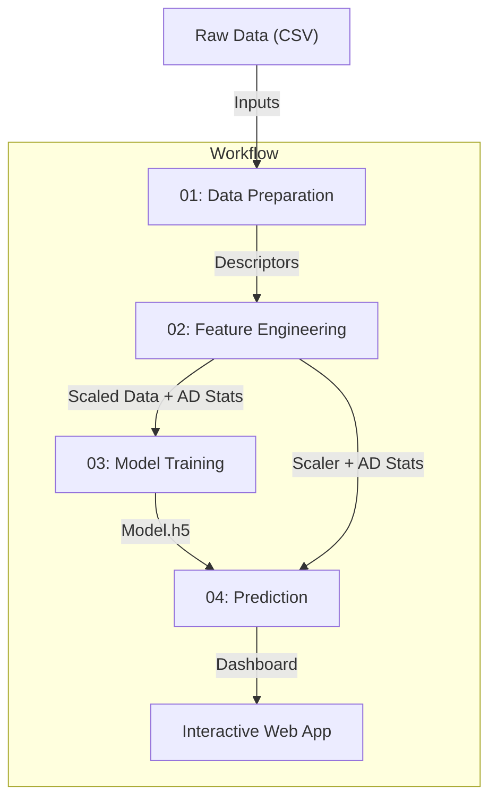

# QSAR Prediction Workflow (Workflow-005)

A comprehensive, modular Deep Learning pipeline for Quantitative Structure-Activity Relationship (QSAR) modeling, designed for the Silva platform. This repository works end-to-end: from raw SMILES data to a deployed, interactive web application.

## 📋 Table of Contents
- [Architecture & Data Architecture](#-architecture--data-flow)
- [Technological Stack](#-technological-stack)
- [Workflow Nodes](#-workflow-nodes-deep-dive)
    - [Node 01: Preparation](#node-01-data-preparation)
    - [Node 02: Feature Engineering](#node-02-feature-engineering)
    - [Node 03: Model Training](#node-03-model-training)
    - [Node 04: Prediction & Dashboard](#node-04-prediction--dashboard)
- [Installation & Docker](#-installation--docker)
- [Usage Guide](#-usage-guide)
- [Inputs & Configuration](#-inputs--configuration)

---

## 🏗 Architecture & Data Flow

This workflow follows a linear, 4-stage pipeline architecture where each stage (Node) is an independent execution unit. The nodes communicate via file-based input/output contracts.



### Key Artifacts
- **Data**: `processed_data.npz` (Compressed NumPy arrays for training)
- **Model**: `model.h5` (Keras/TensorFlow SavedModel)
- **Scaler**: `scaler.pkl` (Scikit-learn StandardScaler)
- **AD Stats**: `ad_stats.json` (Applicability Domain thresholds)

---

## 🛠 Technological Stack

The entire pipeline runs inside a unified **Docker Container** (`chiral.sakuracr.jp/qsar:20260107_v1`).

- **Python**: 3.11
- **Deep Learning**: TensorFlow 2.19.1, Keras
- **Cheminformatics**: RDKit (for molecular descriptor calculation)
- **Data Processing**: NumPy, Pandas, Scikit-learn
- **Web Application**: Flask, Flask-CORS
- **Visualization**: Plotly (Python), HTML5/JS (Dashboard)

---

## 📦 Workflow Nodes: Deep Dive

### Node 01: Data Preparation
**Goal**: Convert raw SMILES strings into numerical molecular descriptors.
- **Input**: `SpikeRBD_DD.csv`
- **Process**:
    1.  **Canonicalization**: Normalizes SMILES using RDKit.
    2.  **Descriptor Calculation**: Computes ~200 RDKit descriptors (e.g., MolLogP, TPSA, MolWt, NumRotatableBonds).
    3.  **Cleaning**: Removes invalid molecules and NaNs.
- **Output**: `descriptors.csv` (Numerical feature matrix).

### Node 02: Feature Engineering
**Goal**: Prepare data for Deep Learning and define the Applicability Domain.
- **Process**:
    1.  **Scaling**: Applies `StandardScaler` (Mean=0, Std=1) to all features.
    2.  **Applicability Domain (AD)**:
        -   Computes Centroid and Mean Euclidean Distance of the training set.
        -   Calculates **Threshold**: $D_{cutoff} = \bar{D} + Z \cdot \sigma$ (Configurable Z-score).
    3.  **Splitting**: 80/20 Train/Test split (Random seed=42).
- **Outlier Handling**: Identifies outliers based on the calculated AD threshold.
- **Outputs**: `processed_data.npz` (Train/Test sets), `scaler.pkl` (for transforming future inputs), `ad_stats.json` (AD parameters).

### Node 03: Model Training
**Goal**: Train a Deep Neural Network (DNN) regressor.
- **Architecture**:
    -   **Input Layer**: Matches descriptor count (~200).
    -   **Hidden Layers**: Dense(600, ReLU) -> Dense(100, ReLU) -> Dense(100, ReLU).
    -   **Output Layer**: Dense(1, Linear) for continuous regression target.
- **Training Config**:
    -   **Optimizer**: Adam
    -   **Loss**: Mean Squared Error (MSE)
    -   **Metrics**: MAE, RMSE, $R^2$
    -   **Early Stopping**: Monitors `val_r_square` with patience=200.
- **Outputs**: `model.h5` (The trained artifact).

### Node 04: Prediction & Dashboard
**Goal**: Predict on new data and host the user interface.
- **Process**:
    1.  **Batch Prediction**: Loads Model, Scaler, and AD Stats. Predicts on the *entire* input dataset (3,010 compounds) to verify performance.
    2.  **Interactive Server**: Starts a Flask Web App.
- **Web App Features**:
    -   Search bar for new SMILES.
    -   Source Detection: "Is this compound in the training set?" vs "Is this new?".
    -   Real-time AD calculation (Is the new molecule similar to training data?).
- **Outputs**: `report.html`, `predictions.csv`, and the live server.

---

## ⚙️ Inputs & Configuration

The workflow is highly configurable via `.chiral/job.toml` files in each node directory.

| Parameter | Node | Default | Description |
|-----------|------|---------|-------------|
| `test_size` | 02 | `0.2` | Fraction of data to split for testing. |
| `z_cutoff` | 02 | `0.5` | Threshold for Applicability Domain (Outlier detection). |
| `epochs` | 03 | `1000` | Maximum training epochs. |
| `batch_size` | 03 | `32` | Training batch size. |
| `server_port`| 04 | `5000` | Port for the Flask web application. |

---

## 📂 Repository Structure
```text
├── .chiral/
│   └── workflow.toml             # Main Workflow Definition
├── 01-data-preparation/
│   ├── .chiral/job.toml
│   ├── outputs/                  # Generated Artifacts
│   ├── run_data_prep.py          # Descriptor calculation script
│   ├── generate_data_prep_report.py # Report generation
│   └── run.sh                    # Execution entry point
├── 02-feature-engineering/
│   ├── .chiral/job.toml
│   ├── outputs/
│   ├── run_feature_eng.py        # Scaling & AD logic
│   ├── generate_feature_eng_report.py
│   └── run.sh
├── 03-model-training/
│   ├── .chiral/job.toml
│   ├── outputs/
│   ├── run_training.py           # Deep Learning Model Training
│   ├── generate_training_report.py
│   └── run.sh
├── 04-prediction/
│   ├── .chiral/job.toml
│   ├── outputs/
│   ├── app.py                    # Flask Web App (Backend)
│   ├── run_prediction.py         # Batch Prediction Logic
│   ├── generate_prediction_report.py
│   ├── start_server.ps1          # Server Launcher Script
│   ├── run.sh
│   └── static/
│       └── index.html            # Web Dashboard
├── input_files/
│   └── SpikeRBD_DD.csv           # Source Dataset
└── README.md
```