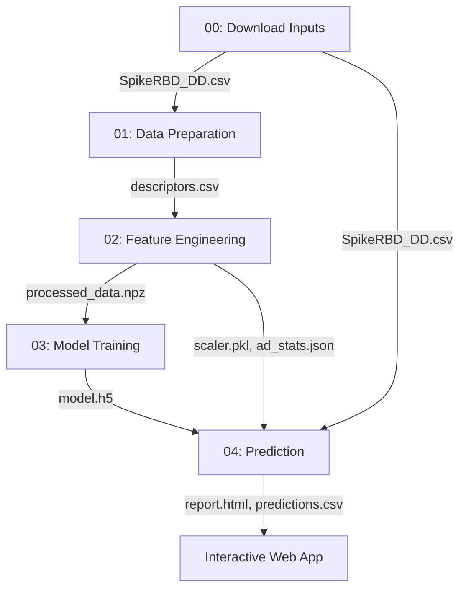

# Workflow 005: QSAR Prediction

A modular Deep Learning pipeline for Quantitative Structure-Activity Relationship (QSAR) modeling. The workflow trains a neural network to predict molecular docking scores from chemical structure, using RDKit descriptors and MACCS fingerprints as features. It runs end-to-end from raw SMILES data to an interactive web application for real-time predictions.

## Overview

QSAR modeling relates molecular structure to biological activity, enabling virtual screening without explicit docking simulations. This workflow computes over 200 RDKit molecular descriptors and 167-bit MACCS structural fingerprints for each molecule, trains a deep neural network regressor to predict docking scores, and provides an interactive Flask web application for querying new compounds with applicability domain checking.

The default dataset contains docking scores of drug-like compounds against the SARS-CoV-2 Spike protein Receptor-Binding Domain (RBD), but the pipeline generalizes to any CSV with SMILES strings and a continuous target variable.

## When to use this workflow

Use this workflow when you have a dataset of molecules with measured or computed activity values (e.g., docking scores, IC50, binding affinity) and want to build a predictive model that generalizes to new compounds. It is best suited for datasets of 500–50,000 molecules with a continuous target variable. The workflow handles descriptor computation, feature scaling, outlier removal, model training, and deployment automatically.

Do not use this workflow for ADMET property prediction — use workflow-014 instead, which uses purpose-built models for pharmacokinetic and toxicity endpoints. Do not use this workflow for structure-based virtual screening where you need to dock molecules against a protein target — use workflow-003 or workflow-004 for molecular docking with Smina or AutoDock Vina. QSAR models are ligand-based and do not use 3D protein structure information directly.

## Architecture and data flow

Nodes 00 through 03 run sequentially. Node 04 depends on nodes 00, 02, and 03 (it needs the original CSV, the scaler/AD stats, and the trained model).

## Input requirements

- **Format:** CSV file with a `smiles` column (case-insensitive) and a numeric target column named `DockingScore` (case-insensitive). An optional `Drug Name` column is used for labeling.
- **Constraints:** Molecules must be valid SMILES parseable by RDKit. The target variable should be continuous (regression). No organism or size constraints, but the default neural network architecture is optimized for datasets of 1,000–10,000 molecules.
- **Placement:** Place your CSV in `input_files/`. Set the `input_csv` parameter in Node 01 if the filename differs from the default.
- **Sample data:** `SpikeRBD_DD.csv` — docking scores of drug-like compounds against the SARS-CoV-2 Spike RBD (3,010 compounds, binding energies in kcal/mol).

## Workflow nodes

### Node 00: Download Inputs

**Goal:** Fetch the sample QSAR dataset before the pipeline begins.

**Process:** Downloads `SpikeRBD_DD.csv` from the repository's GitHub URL via HTTP. The source URL is configurable via the `csv_url` parameter.

**Scientific notes:** The default dataset contains compounds docked against the SARS-CoV-2 Spike protein Receptor-Binding Domain (RBD), a key target for COVID-19 therapeutic development. Docking scores represent predicted binding free energy (more negative = stronger binding).

**Outputs:**
- `SpikeRBD_DD.csv` — CSV with Drug Name, CAS number, SMILES, and DockingScore columns

### Node 01: Data Preparation

**Goal:** Convert raw SMILES strings into numerical molecular descriptors.

**Process:** Canonicalizes SMILES using RDKit, then computes two feature sets per molecule: (1) over 200 RDKit 2D molecular descriptors (e.g., MolLogP, TPSA, MolWt, NumRotatableBonds) using `MolecularDescriptorCalculator`, and (2) 167-bit MACCS structural key fingerprints. Invalid molecules that fail RDKit parsing are removed. Features are concatenated into a single descriptor matrix.

**Scientific notes:** RDKit 2D descriptors capture physicochemical properties (lipophilicity, polarity, size, flexibility) that influence biological activity. MACCS keys encode the presence or absence of 166 predefined structural patterns (functional groups, ring systems), providing complementary structural information. Using both descriptor types gives the model access to both continuous physicochemical properties and discrete structural features.

**Outputs:**
- `descriptors.csv` — numerical feature matrix with all descriptors per molecule
- `report.html` — visualization of descriptor distributions and correlation matrix

### Node 02: Feature Engineering

**Goal:** Prepare data for deep learning by scaling features, detecting outliers, and defining the applicability domain.

**Process:** Splits data into training (70%) and test (30%) sets. Applies `StandardScaler` (zero-mean, unit-variance normalization) fitted on training data. Performs dimensionality reduction with PCA (2 components) and applies Isolation Forest for outlier detection (contamination rate configurable, default 10%). Outliers are removed from both train and test sets. Computes per-feature min/max bounds from training data to define the applicability domain.

**Scientific notes:** The applicability domain defines the chemical space where the model's predictions are reliable. A compound is flagged as "OUT" of domain if any of its feature values falls outside the training set's min/max range. Isolation Forest identifies training outliers that could distort the model — it works by randomly partitioning data and measuring how easily each point is isolated, with anomalies requiring fewer partitions.

**Outputs:**
- `processed_data.npz` — cleaned, scaled train/test arrays
- `scaler.pkl` — fitted StandardScaler for transforming new inputs
- `ad_stats.json` — per-feature min/max bounds for applicability domain checking
- `report.html` — PCA visualization, outlier analysis

### Node 03: Model Training

**Goal:** Train a deep neural network regressor to predict docking scores from molecular descriptors.

**Process:** Builds a sequential Keras model: Dense(600, ReLU) → Dense(100, ReLU) → Dense(100, ReLU) → Dense(1, Linear). Trains with Adam optimizer, MSE loss, and early stopping monitoring validation R² (patience=200, restores best weights). Reports MAE, RMSE, and R² on both training and test sets.

**Scientific notes:** The architecture follows a tapering pattern (wide first layer narrowing to smaller layers), which is standard for QSAR deep learning. The wide first layer (600 units) allows the network to learn diverse feature combinations from the ~370 input descriptors (200+ RDKit + 167 MACCS). Early stopping on validation R² prevents overfitting while allowing sufficient training time for convergence. For docking score prediction, R² values of 0.6–0.8 on the test set are considered good; above 0.8 is excellent.

**Outputs:**
- `model.h5` — trained Keras model
- `report.html` — training curves, performance metrics, actual vs. predicted plots

### Node 04: Prediction and Dashboard

**Goal:** Generate batch predictions and host an interactive web application for querying new compounds.

**Process:** Operates in two modes: (1) batch prediction on the entire input dataset (default) or on a user-provided list of SMILES, and (2) an interactive Flask web server with a REST API for real-time single-molecule predictions. For each prediction, computes descriptors, scales them using the saved scaler, checks applicability domain status, and returns the predicted docking score.

**Scientific notes:** The applicability domain check is critical for responsible use — predictions for molecules structurally dissimilar to the training data (flagged as "OUT") should be treated with low confidence. The web application also detects whether a queried compound was part of the training set, helping researchers distinguish genuine predictions from memorized values.

**Outputs:**
- `predictions.csv` — predicted docking scores with AD status for all compounds
- `report.html` — prediction summary and visualizations
- Live Flask web server (port configurable via `server_port`)

## Parameters

### csv_url (Node 00)

- **Type:** string
- **Default:** GitHub URL to `SpikeRBD_DD.csv`
- **Description:** Direct URL to the input CSV file for download.
- **Guidance:** Change to point to your own hosted dataset. Leave as default to use the sample Spike RBD docking data.

### input_csv (Node 01)

- **Type:** string
- **Default:** `""` (auto-detect)
- **Description:** Name of the input CSV file in the inputs directory.
- **Guidance:** Leave empty to auto-detect the first CSV in `inputs/`. Set explicitly if multiple CSV files are present.

### test_size (Node 02)

- **Type:** string
- **Default:** `0.3`
- **Description:** Fraction of data reserved for the test set.
- **Guidance:** 0.3 (30%) is the workflow default. For smaller datasets (< 500 molecules), consider reducing to 0.2 to retain more training data. For larger datasets (> 5,000), 0.3 is appropriate.

### contamination (Node 02)

- **Type:** string
- **Default:** `0.1`
- **Description:** Expected proportion of outliers for Isolation Forest outlier detection.
- **Guidance:** 0.1 (10%) is a conservative default. Increase to 0.15–0.2 if the dataset is known to contain noisy or erroneous measurements. Decrease to 0.05 for curated datasets with few expected outliers.

### epochs (Node 03)

- **Type:** string
- **Default:** `200`
- **Description:** Maximum number of training epochs.
- **Guidance:** Early stopping typically halts training before reaching the maximum. Increase to 500–1000 for complex datasets where the model converges slowly.

**Test vs production:** The default of 200 epochs with early stopping (patience=200) is suitable for both testing and production. For faster test runs, reduce to 50.

### batch_size (Node 03)

- **Type:** string
- **Default:** `400`
- **Description:** Number of samples per gradient update during training.
- **Guidance:** 400 works well for the default dataset (~3,000 compounds). For smaller datasets (< 500), reduce to 32–64 to ensure sufficient gradient updates per epoch.

### test_smiles (Node 04)

- **Type:** string
- **Default:** `""` (empty)
- **Description:** Comma-separated SMILES strings to predict (e.g., `CCO,c1ccccc1`).
- **Guidance:** Leave empty when `predict_all_data=true`. Use this parameter to predict specific molecules of interest.

### predict_all_data (Node 04)

- **Type:** string
- **Default:** `true`
- **Description:** If true, predicts on all compounds from the input dataset. If false, requires `test_smiles`.
- **Guidance:** Set to `true` for validation runs (comparing predictions to known values). Set to `false` with specific SMILES for targeted prediction of new candidates.

## Outputs and interpretation

### predictions.csv

Contains predicted docking scores and applicability domain status for each compound. Columns: `drug_name`, `smiles`, `prediction`, `ad_status`.

### Predicted docking score

The predicted binding free energy in kcal/mol (when using the default Spike RBD dataset). More negative values indicate stronger predicted binding. Typical range: -5 to -10 kcal/mol. Values more negative than -7 kcal/mol generally indicate good binding affinity. Note that these are predictions of docking scores, not experimental binding affinities — they inherit the approximations of the original docking method.

### ad_status (Applicability Domain)

Reports whether a compound falls within ("IN") or outside ("OUT") the chemical space of the training data. Predictions for "OUT" compounds should be treated with low confidence, as the model is extrapolating beyond its training distribution. The AD is defined by per-feature min/max bounds from the training set.

### Model performance metrics (report.html)

- **R² (coefficient of determination):** Fraction of variance explained. Values of 0.6–0.8 indicate a useful predictive model; > 0.8 is excellent. Values < 0.5 suggest the model may not generalize well.
- **RMSE (root mean squared error):** Average prediction error in the same units as the target (kcal/mol for docking scores). Lower is better.
- **MAE (mean absolute error):** Average absolute deviation between predicted and actual values.

## Quick start

### Running with Docker

The workflow uses the `qsar:20260527` Docker image (based on micromamba with Python 3.11, RDKit, TensorFlow, scikit-learn).

### Running on Silva

1. Select workflow-005 from the workflow list
2. Upload your CSV to `input_files/` (or use the built-in Spike RBD dataset)
3. Adjust parameters if needed (see Parameters section)
4. Click Run

### Test vs production settings

| Setting | Test | Production |
|---------|------|------------|
| `test_size` | `0.3` | `0.2`–`0.3` depending on dataset size |
| `epochs` | `50` (fast) | `200` (default, with early stopping) |
| `batch_size` | `400` | Adjust based on dataset size |
| `contamination` | `0.1` | `0.05`–`0.1` depending on data quality |

A successful test run with the default Spike RBD dataset produces a trained model, predictions for all 3,010 compounds, and an interactive web dashboard.

## References

- Tropsha A. "Best Practices for QSAR Model Development, Validation, and Exploitation." *Molecular Informatics* 29(6-7):476-488, 2010. DOI: https://doi.org/10.1002/minf.201000061
- [RDKit: Open-Source Cheminformatics](https://www.rdkit.org/)
- [TensorFlow / Keras documentation](https://www.tensorflow.org/)
- Sahigara F et al. "Comparison of Different Approaches to Define the Applicability Domain of QSAR Models." *Molecules* 17(5):4791-4810, 2012. DOI: https://doi.org/10.3390/molecules17054791
