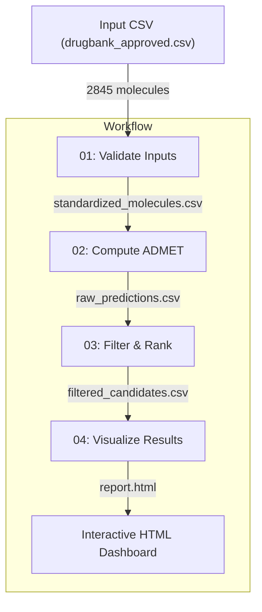

# ADMET-AI Prediction Workflow (Workflow-014)

A modular drug discovery pipeline for predicting ADMET (Absorption, Distribution, Metabolism, Excretion, and Toxicity) properties of molecules using the [ADMET-AI](https://github.com/swansonk14/admet_ai) machine learning engine, designed for the Silva platform. This workflow takes a CSV of SMILES strings and produces a ranked list of drug candidates with an interactive HTML dashboard.

## 📋 Table of Contents

- [Architecture & Data Flow](#architecture--data-flow)
- [Workflow Nodes](#workflow-nodes-deep-dive)
  - [Node 01: Validate Inputs](#node-01-validate-inputs)
  - [Node 02: Compute ADMET Predictions](#node-02-compute)
  - [Node 03: Filter & Rank Candidates](#node-03-analyze)
  - [Node 04: Visualize Results](#node-04-visualize)
- [Inputs & Configuration](#inputs--configuration)
- [Repository Structure](#repository-structure)

---

## 🏗 Architecture & Data Flow

This workflow follows a linear, 4-stage pipeline architecture where each stage (Node) is an independent execution unit. Nodes communicate via file-based input/output contracts, with Silva wiring each node's `outputs/` directory into the next node's `inputs/` directory.



### Key Artifacts

- **Validated Data**: `standardized_molecules.csv` (Canonicalized, deduplicated SMILES)
- **Raw Predictions**: `raw_predictions.csv` (All ~59 ADMET properties per molecule)
- **Ranked Candidates**: `filtered_candidates.csv` (Top N molecules passing safety/efficacy filters)
- **Dashboard**: `report.html` (Self-contained HTML with radar charts and data tables)

---

## 📦 Workflow Nodes: Deep Dive

### Node 01: Validate Inputs

**Goal**: Validate the input CSV and standardize all SMILES strings using RDKit.

- **Input**: `drugbank_approved.csv` (or any CSV with a SMILES column)
- **Process**:
  1. **Column Validation**: Verifies the configured SMILES column exists.
  2. **Standardization**: Uses RDKit to canonicalize SMILES — applies `Uncharger` and `Cleanup` for consistent representation.
  3. **Deduplication**: Removes duplicate molecules by canonical SMILES (keeps first occurrence).
  4. **Fallback**: If RDKit is unavailable, falls back to basic string validation.
- **Outputs**: `standardized_molecules.csv`, `validation_report.json` (counts of invalid/duplicate entries removed).

### Node 02: Compute ADMET Predictions

**Goal**: Run the ADMET-AI prediction engine on all validated molecules.

- **Process**:
  1. Invokes the `admet_predict` CLI tool, which uses Chemprop message-passing neural networks and PyTorch under the hood.
  2. Predicts ~59 pharmacological properties per molecule across safety, absorption, metabolism, distribution, excretion, and drug-likeness categories.
- **Predicted Property Categories**:

  | Category | Example Properties |
  |----------|-------------------|
  | Safety/Toxicity | hERG, AMES, DILI, ClinTox, Skin_Reaction, LD50_Zhu |
  | Absorption | BBB_Martins, HIA_Hou, Bioavailability_Ma, Caco2_Wang, Pgp_Broccatelli |
  | Metabolism (CYP450) | CYP1A2, CYP2C19, CYP2C9, CYP2D6, CYP3A4 |
  | Distribution | PPBR_AZ, VDss_Lombardo, Lipophilicity_AstraZeneca |
  | Excretion | Clearance_Hepatocyte_AZ, Clearance_Microsome_AZ, Half_Life_Obach |
  | Drug-likeness | Lipinski, QED, Solubility_AqSolDB |

- **Output**: `raw_predictions.csv` (original data extended with all predicted ADMET columns).

### Node 03: Filter & Rank Candidates

**Goal**: Apply configurable safety/efficacy filters and rank candidates using a multi-parameter optimization (MPO) score.

- **Process**:
  1. **Filtering**: Applies user-configurable threshold filters (e.g., hERG < 0.5, BBB > 0.5). Supports operators `>`, `<`, `>=`, `<=` and named presets like `"safe"` / `"strict"`.
  2. **MPO Scoring**: Computes a weighted composite score across key ADMET properties:
     - **Positive weights** (higher is better): BBB, Bioavailability, HIA, QED (weight 1.0); Lipinski, Caco2 (weight 0.5)
     - **Negative weights** (lower is better): hERG, DILI, AMES, ClinTox (weight -1.0)
  3. **Ranking**: Sorts by MPO score descending and selects the top N candidates.
- **Outputs**: `filtered_candidates.csv` (top N candidates), `analysis_summary.json` (filter statistics, MPO weights, candidate list).

### Node 04: Visualize Results

**Goal**: Generate a self-contained HTML dashboard for visual analysis of ranked candidates.

- **Process**:
  1. Builds summary cards (total candidates, average/best MPO scores, safety panel pass count).
  2. Generates Plotly.js radar charts for the top 5 candidates across 9 ADMET dimensions (risk properties are inverted so higher = better on all axes).
  3. Builds a color-coded data table with all candidates and 20 ADMET properties (green/yellow/red thresholds).
- **Dashboard Features**:
  - Bootstrap 5 responsive layout
  - Interactive Plotly.js radar chart with hover details
  - Color-coded table: green for favorable values, red for concerning values
  - Sticky headers and SMILES monospace formatting
- **Output**: `report.html` (self-contained, no server required).

---

## Configuration

The workflow is configurable via `.chiral/job.toml` files in each node directory. Parameters are passed as `PARAM_*` environment variables at runtime.

### Global Parameters

| Parameter       | Default                      | Description                                    |
| --------------- | ---------------------------- | ---------------------------------------------- |
| `input_file`    | `inputs/drugbank_approved.csv` | Path to input CSV file                         |
| `smiles_column` | `smiles`                     | Name of the column containing SMILES strings   |

### Node 03 Filter Parameters - params.json

| Parameter        | Default  | Description                                              |
| ---------------- | -------- | -------------------------------------------------------- |
| `top_n`          | `20`     | Number of top-ranked candidates to return                |
| `filter_hERG`    | `safe`   | hERG filter: `"safe"` (< 0.5), `"strict"` (< 0.3), or a threshold |
| `filter_Caco2`   | `>-5.15` | Caco2 permeability threshold                             |
| `filter_BBB`     | `>0.5`   | Blood-brain barrier permeability min probability         |
| `filter_HIA`     | `>0.5`   | Human Intestinal Absorption min probability              |
| `filter_DILI`    | `<0.5`   | Drug-Induced Liver Injury max probability                |
| `filter_AMES`    | `<0.5`   | AMES mutagenicity max probability                        |
| `filter_ClinTox` | `<0.3`   | Clinical Toxicity max probability                        |

### Container

All nodes use the `admet-pipeline:latest` Docker image, built from the included `Dockerfile` (based on `continuumio/miniconda3` with `admet-ai` pre-installed).

### Input Files
- `sample_molecules.csv` — Any CSV with a SMILES column 

### Output Files
- `report.html` — HTML dashboard with radar charts and data tables of filtered and ranked molecules 

### Running
1. Place input files in `input_files/`
2. Set `SILVA_WORKFLOW_HOME` to the parent directory
3. Launch Silva and select this workflow
4. Press Enter to run

### Requirements
- Docker
- Silva (https://github.com/chiral-data/silva)

---

## Repository Structure

```text
workflows/workflow-014/
├── .chiral/
│   └── workflow.toml                # Workflow definition (DAG + global params)
├── Dockerfile                       # Container image for all nodes
├── global_params.json               # Default parameter values
├── input_files/
│   └── drugbank_approved.csv        # Source dataset (2845 FDA-approved drugs)
├── 01_validate_inputs/
│   ├── .chiral/job.toml             # Node config (inputs, outputs, params)
│   ├── .chiral/test_inputs/
│   │   └── sample_molecules.csv     # Test data for local development
│   ├── run.sh                       # Execution entry point
│   └── validate.py                  # SMILES validation & standardization
├── 02_compute/
│   ├── .chiral/job.toml
│   ├── run.sh
│   └── compute_admet.py             # ADMET-AI CLI wrapper
├── 03_analyze/
│   ├── .chiral/job.toml
│   ├── run.sh
│   └── analyze.py                   # MPO scoring, filtering, ranking
├── 04_visualize/
│   ├── .chiral/job.toml
│   ├── run.sh
│   └── generate_report.py           # HTML dashboard generator
└── README.md
```
