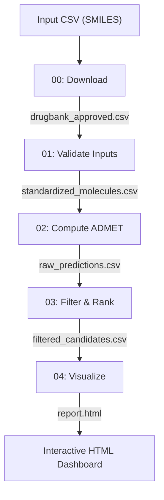

# Workflow 014: ADMET-AI Prediction

A modular drug discovery pipeline that predicts Absorption, Distribution, Metabolism, Excretion, and Toxicity (ADMET) properties of molecules using the ADMET-AI machine learning engine. The workflow takes a CSV of SMILES strings and produces a ranked list of drug candidates with an interactive HTML dashboard.

## Overview

ADMET-AI uses Chemprop graph neural networks with message-passing architecture to predict 41 pharmacological properties per molecule, trained on curated datasets from the Therapeutics Data Commons (TDC). An additional 8 physicochemical descriptors are computed via RDKit, giving 49 total properties. The pipeline validates and standardizes input SMILES using RDKit, runs batch ADMET predictions, applies configurable safety and efficacy filters, computes a multi-parameter optimization (MPO) score to rank candidates, and generates a self-contained HTML dashboard for visual analysis.

This workflow is designed for early-stage drug discovery screening where researchers need to rapidly triage large compound libraries by predicted ADMET profiles before committing to synthesis or experimental assays (Swanson et al., 2024).

## When to use this workflow

Use this workflow when you have a library of drug-like small molecules (as SMILES strings in a CSV) and need to predict their ADMET properties for lead optimization or compound triage. It is well suited for screening libraries of 100–10,000 molecules. The default input is the DrugBank approved drugs dataset (2,845 molecules), but any CSV with a SMILES column works.

Do not use this workflow for macromolecules (proteins, antibodies, nucleic acids) or for predicting binding affinity to a specific target — use workflow-005 (QSAR) for target-specific quantitative predictions, or workflow-003/workflow-004 for molecular docking against a protein structure. ADMET-AI predicts general pharmacokinetic and toxicity properties, not target engagement. Note that ADMET-AI predictions are based on chemical structure alone and do not account for formulation, prodrug activation, or in vivo pharmacokinetics beyond what the training data captures.

## Architecture and data flow



Nodes run sequentially: 00 → 01 → 02 → 03 → 04.

## Input requirements

- **Format:** CSV file with a SMILES column (default column name: `smiles`). An optional `molecule_id` column is recommended for tracking.
- **Constraints:** Molecules must be valid small-molecule SMILES parseable by RDKit. No size limit is enforced, but the pipeline is optimized for libraries up to ~10,000 molecules.
- **Placement:** Place your CSV in `input_files/` and set the `input_file` parameter to point to it.
- **Sample data:** The workflow includes a download node (Node 00) that fetches the DrugBank approved drugs dataset (2,845 FDA-approved molecules) from the ADMET-AI repository for testing.

## Workflow nodes

### Node 00: Download Sample Inputs

**Goal:** Fetch the default DrugBank approved drugs dataset from the ADMET-AI GitHub repository.

**Process:** Downloads `drugbank_approved.csv` via HTTP from the ADMET-AI repository's resource data directory. This step is skipped if you provide your own input file.

**Scientific notes:** The DrugBank approved dataset contains 2,845 FDA-approved drugs with known SMILES, providing a validated reference set for benchmarking ADMET predictions against clinically established compounds.

**Outputs:**
- `drugbank_approved.csv` — CSV with molecule names and SMILES strings

### Node 01: Validate Inputs

**Goal:** Validate the input CSV and standardize all SMILES strings using RDKit.

**Process:** Reads the input CSV, verifies the configured SMILES column exists, then canonicalizes each SMILES string using RDKit's `MolFromSmiles`, `Uncharger` (neutralization), and `Cleanup` standardization. Duplicate molecules (by canonical SMILES) are removed, keeping the first occurrence. If RDKit is unavailable, falls back to basic string validation.

**Scientific notes:** SMILES canonicalization ensures that different string representations of the same molecule (e.g., `C(=O)O` vs `OC=O`) are unified before prediction. Neutralization via `Uncharger` removes charge states that could bias predictions, since most ADMET training data uses neutral forms.

**Outputs:**
- `standardized_molecules.csv` — deduplicated, canonicalized molecules
- `validation_report.json` — counts of invalid and duplicate entries removed

### Node 02: Compute ADMET Predictions

**Goal:** Run the ADMET-AI prediction engine on all validated molecules.

**Process:** Invokes the `admet_predict` CLI tool, which uses Chemprop message-passing neural networks to predict 41 ADMET properties per molecule across safety, absorption, metabolism, distribution, excretion, and drug-likeness categories. Properties include both classification tasks (e.g., hERG inhibition, AMES mutagenicity) and regression tasks (e.g., Caco-2 permeability, clearance).

**Scientific notes:** Chemprop learns molecular representations directly from the molecular graph (atoms as nodes, bonds as edges) rather than relying on precomputed fingerprints. Models were trained on curated datasets from the Therapeutics Data Commons (TDC), covering 22 ADMET-relevant benchmarks. Classification outputs are probabilities in [0, 1]; regression outputs are in dataset-specific units (e.g., log cm/s for Caco-2).

**Outputs:**
- `raw_predictions.csv` — original data extended with all predicted ADMET columns

### Node 03: Filter and Rank

**Goal:** Apply configurable safety and efficacy filters and rank candidates using a multi-parameter optimization (MPO) score.

**Process:** Applies threshold filters for key safety properties (hERG, DILI, AMES, ClinTox) and absorption properties (Caco-2, BBB, HIA). Supports comparison operators (`>`, `<`, `>=`, `<=`) and named presets (`"safe"`, `"strict"`). Computes a weighted MPO score across 10 normalized ADMET properties: positive weights for desirable properties (BBB, Bioavailability, HIA, QED at weight 1.0; Caco-2, Lipinski at 0.5) and negative weights for risk properties (hERG, DILI, AMES, ClinTox at -1.0). Candidates passing all filters are ranked by MPO score and the top N are returned.

**Scientific notes:** Multi-parameter optimization balances competing objectives inherent in drug design — a molecule with excellent absorption may have unacceptable toxicity. The MPO approach avoids selecting molecules that excel in one dimension but fail in others. The default filter thresholds reflect standard pharmaceutical industry cutoffs (e.g., Caco-2 > -5.15 log cm/s for adequate oral absorption, hERG < 0.5 probability for cardiac safety).

**Outputs:**
- `filtered_candidates.csv` — top N candidates passing all filters, ranked by MPO score
- `analysis_summary.json` — filter statistics, MPO weights, and candidate metadata

### Node 04: Visualize Results

**Goal:** Generate a self-contained HTML dashboard for visual analysis of ranked candidates.

**Process:** Builds summary cards (total candidates, average/best MPO scores, safety panel pass count), generates Plotly.js radar charts for the top 5 candidates across 9 ADMET dimensions (risk properties are inverted so higher = better on all axes), and creates color-coded data tables with green/yellow/red thresholds for 20 ADMET properties.

**Scientific notes:** The radar chart visualization enables rapid comparison of candidate profiles across multiple ADMET dimensions simultaneously, which is more informative than ranking by a single score. Color thresholds in the data table follow pharmaceutical industry conventions: for example, hERG probability < 0.3 (green/safe), 0.3–0.5 (yellow/caution), ≥ 0.5 (red/concern).

**Outputs:**
- `report.html` — self-contained HTML dashboard (Bootstrap 5 + Plotly.js, no server required)

## Parameters

### input_file

- **Type:** string
- **Default:** `inputs/drugbank_approved.csv`
- **Description:** Path to the input CSV file containing molecules with a SMILES column.
- **Guidance:** Change this to point to your own molecule library. The file must be placed in `input_files/`.

### smiles_column

- **Type:** string
- **Default:** `smiles`
- **Description:** Name of the CSV column containing SMILES strings.
- **Guidance:** Change if your CSV uses a different column name (e.g., `canonical_smiles`, `SMILES`).

### top_n

- **Type:** integer
- **Default:** `20`
- **Description:** Number of top-ranked candidates to return after filtering and MPO scoring.
- **Guidance:** Increase for broader screening (e.g., 100 for initial triage); decrease for focused lead selection (e.g., 5–10).

### filter_hERG

| Value | Description |
|-------|-------------|
| `safe` (default) | Excludes molecules with hERG inhibition probability ≥ 0.5 (standard cardiac safety cutoff) |
| `strict` | Excludes molecules with hERG inhibition probability ≥ 0.3 (conservative cutoff) |
| numeric (e.g., `0.4`) | Custom maximum probability threshold |

**Trade-off:** Stricter thresholds reduce cardiac toxicity risk but may eliminate otherwise promising candidates. The `safe` threshold (0.5) is the standard TDC benchmark cutoff; `strict` (0.3) is appropriate for risk-averse programs.

### filter_Caco2

- **Type:** string
- **Default:** `>-5.15`
- **Description:** Caco-2 permeability threshold in log cm/s (log apparent permeability coefficient).
- **Guidance:** The -5.15 log cm/s cutoff is the established literature threshold separating high-permeability from low-permeability compounds for oral absorption prediction. Lower this value only if screening for compounds that may rely on active transport.

### filter_BBB

- **Type:** string
- **Default:** `>0.5`
- **Description:** Minimum probability for blood-brain barrier penetration.
- **Guidance:** Set to `<0.5` instead if designing peripherally-acting drugs that should NOT cross the BBB. The default selects for CNS-penetrant compounds.

### filter_HIA, filter_DILI, filter_AMES, filter_ClinTox

| Parameter | Default | What it filters |
|-----------|---------|----------------|
| `filter_HIA` | `>0.5` | Minimum Human Intestinal Absorption probability |
| `filter_DILI` | `<0.5` | Maximum Drug-Induced Liver Injury probability |
| `filter_AMES` | `<0.5` | Maximum AMES mutagenicity probability |
| `filter_ClinTox` | `<0.3` | Maximum clinical trial toxicity probability |

**Test vs production:** Defaults are suitable for both testing and production screening. For publication-quality results with conservative safety margins, consider using `strict` for hERG and lowering DILI/AMES thresholds to `<0.3`.

## Outputs and interpretation

### MPO score

The multi-parameter optimization score is a weighted composite of 10 normalized ADMET properties. Higher values indicate a more favorable overall ADMET profile. Typical range for drug-like molecules is 0.3–0.8. Scores above 0.6 indicate a well-balanced candidate; scores below 0.3 suggest significant liabilities in one or more dimensions. The score is relative within a dataset and should not be compared across different screening runs with different filter settings.

### hERG inhibition probability

Predicts whether a compound blocks the hERG potassium ion channel (encoded by KCNH2). Probability > 0.5 indicates predicted hERG blockade, which can cause QT interval prolongation and potentially fatal cardiac arrhythmias. This is one of the most common reasons for drug withdrawal from market. Dataset: TDC hERG benchmark (binary classification at 10 μM threshold).

### AMES mutagenicity probability

Predicts whether a compound is mutagenic based on the Ames bacterial reverse mutation assay. Probability > 0.5 indicates predicted mutagenicity. A positive Ames result is a regulatory red flag for genotoxic carcinogenicity. Dataset: 7,255 compounds from literature.

### ClinTox probability

Predicts likelihood of clinical trial failure due to toxicity, based on the MoleculeNet ClinTox dataset (1,484 drugs that failed vs. succeeded in clinical trials). Probability > 0.3 warrants caution; > 0.5 indicates high predicted clinical toxicity risk.

### Caco-2 permeability (log cm/s)

Predicted apparent permeability through Caco-2 human colon epithelial cells, an in vitro model of intestinal absorption. Values > -5.15 log cm/s indicate high permeability (good oral absorption); values < -5.15 indicate low permeability. Dataset: 906 compounds (Wang et al.).

### BBB penetration probability

Predicts whether a compound crosses the blood-brain barrier. Probability > 0.5 indicates predicted BBB penetration. Desirable for CNS drugs; undesirable for peripherally-acting drugs where CNS side effects are a concern. Dataset: 1,975 compounds (Martins et al.).

### report.html

Self-contained HTML dashboard with summary cards, interactive Plotly.js radar charts for the top 5 candidates, and color-coded data tables. Green cells indicate favorable values, yellow indicates caution, and red indicates concerning values based on pharmaceutical industry thresholds. Can be opened directly in any browser.

## Quick start

### Running with Docker

The workflow uses the `admet-pipeline:latest` image built from the included `Dockerfile` (based on `continuumio/miniconda3` with `admet-ai` pre-installed).

```bash
docker build -t admet-pipeline:latest -f workflows/workflow-014/Dockerfile .
```

### Running on Silva

1. Select workflow-014 from the workflow list
2. Upload your input CSV to `input_files/` (or use the built-in DrugBank dataset)
3. Adjust parameters if needed (see Parameters section)
4. Click Run

### Test vs production settings

| Setting | Test (default) | Production |
|---------|---------------|------------|
| `input_file` | `inputs/drugbank_approved.csv` (2,845 drugs) | Your molecule library |
| `top_n` | `20` | `50`–`100` for broader screening |
| `filter_hERG` | `safe` (< 0.5) | `strict` (< 0.3) for safety-critical programs |
| `filter_ClinTox` | `<0.3` | `<0.3` (same) |

A successful test run with the default DrugBank dataset produces a `report.html` with 20 ranked candidates and radar charts.

## References

- Swanson K, Walther P, Leitz J, Mukherjee S, Wu JC, Shivnaraine RV, Zou J. "ADMET-AI: A machine learning ADMET platform for evaluation of large-scale chemical libraries." *Bioinformatics* 40(7):btae416, 2024. DOI: https://doi.org/10.1093/bioinformatics/btae416
- [ADMET-AI documentation](https://github.com/swansonk14/admet_ai)
- [Therapeutics Data Commons (TDC)](https://tdcommons.ai/) — source of ADMET training datasets
