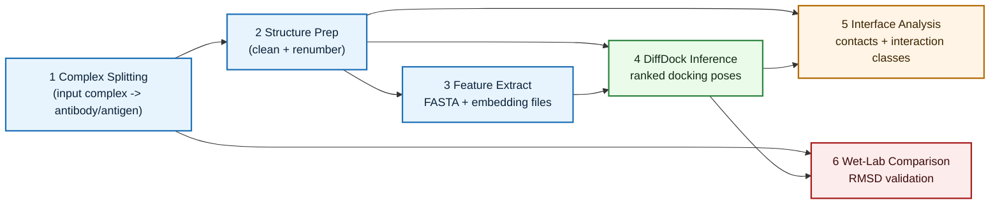

# DiffDock-PP Antibody-Antigen Docking Pipeline

## Overview
This repository provides a six-node workflow for antibody-antigen docking with DiffDock-PP.

The pipeline is designed to be:
- Modular: each node can be run independently.
- Reproducible: each node writes machine-readable outputs.
- Interpretable: each node provides an HTML report.

Core scientific goals:
- Predict antigen pose relative to an antibody receptor.
- Analyze interface interactions in the top-ranked pose.
- Quantify structural agreement with a wet-lab complex when available.

## Node Dependency Graph
The diagram below shows the Silva execution dependencies in a KNIME-like left-to-right node flow.



## Node Data Flow Graph
The diagram below shows the main files passed between nodes (KNIME-style data channels).

```mermaid
flowchart LR
  IN["input_files/5B8C.pdb"]

  N1["1 Complex Splitting"]
  N2["2 Structure Prep"]
  N3["3 Feature Extract"]
  N4["4 DiffDock Inference"]
  N5["5 Interface Analysis"]
  N6["6 Wet-Lab Comparison"]

  IN -->|complex.pdb| N1

  N1 -->|antibody.pdb\nantigen.pdb| N2
  N2 -->|processed_antibody.pdb\nprocessed_antigen.pdb| N3
  N2 -->|processed_antibody.pdb\nprocessed_antigen.pdb| N4
  N3 -->|antibody_features.pt\nantigen_features.pt| N4

  N4 -->|rank1.pdb\nconfidence_scores.json| N5
  N2 -->|processed_antibody.pdb| N5

  N1 -->|original_complex.pdb\nchain_info.json| N6
  N4 -->|rank1.pdb| N6

  N6 -->|rmsd_analysis.json\nfinal_comparison_report.txt\nreport.html| OUT["Validation Outputs"]

  classDef input fill:#EEF2FF,stroke:#3B5BCC,stroke-width:2px,color:#0A1A4F;
  classDef prep fill:#E8F4FD,stroke:#1D70B8,stroke-width:2px,color:#0B2239;
  classDef infer fill:#EAFBEA,stroke:#2E8540,stroke-width:2px,color:#102A16;
  classDef analysis fill:#FFF4E5,stroke:#B26A00,stroke-width:2px,color:#3B2400;
  classDef validate fill:#FDECEC,stroke:#A61B1B,stroke-width:2px,color:#3D0A0A;

  class IN,OUT input;
  class N1,N2,N3 prep;
  class N4 infer;
  class N5 analysis;
  class N6 validate;
```



## Pipeline Outputs
At the end of a full run, the main deliverables are:
- `4_diffdock_inference/outputs/rank1.pdb`: top predicted docked pose.
- `5_diffdock_analysis/outputs/interface_analysis.txt`: interface interaction summary.
- `6_docking_comparison/outputs/final_comparison_report.txt` (or enhanced output dir): RMSD-based validation summary.

## Repository Layout
```text
workflows/workflow-016/
|- 1_complex_splitting/
|  |- 1_complex_split_science.py
|  |- 2_complex_split_html.py
|  |- 1_complex_splitting_run.sh
|  |- outputs/
|- 2_diffdock_prep/
|  |- 3_structure_prep_science.py
|  |- 4_structure_prep_html.py
|  |- 2_structure_prep_run.sh
|  |- outputs/
|- 3_diffdock_features/
|  |- 5_feature_extract_science.py
|  |- 6_feature_extract_html.py
|  |- 3_feature_extract_run.sh
|  |- outputs/
|- 4_diffdock_inference/
|  |- 7_diffdock_inference_science.py
|  |- 8_diffdock_inference_html.py
|  |- 4_diffdock_inference_run.sh
|  |- outputs/
|- 5_diffdock_analysis/
|  |- 9_analysis_science.py
|  |- 10_analysis_html.py
|  |- 5_analysis_run.sh
|  |- outputs/
|- 6_docking_comparison/
|  |- 11_comparison_science.py
|  |- 12_comparison_html.py
|  |- 6_comparison_run.sh
|  |- outputs/
|- input_files/
|- docker/
|- scripts/
|- environment.yml
|- README.md
```

## Requirements
- Linux environment (recommended).
- Conda (or Mamba).
- Python dependencies from `environment.yml`.
- DiffDock-PP available either:
  - in Docker image, or
  - locally in your conda environment, or
  - via `DIFFDOCK_PP_PATH`.

Optional:
- NVIDIA GPU + CUDA stack for acceleration.

## Installation
### 1. Create environment
```bash
conda env create -f environment.yml
conda activate diffdock_abag
```

### 2. Build Docker image (optional)
```bash
chmod +x docker/build.sh
./docker/build.sh
```

### 3. Install DiffDock-PP locally (optional)
```bash
conda activate diffdock_abag
bash scripts/install_diffdock_pp.sh
```

## Input Data
Primary expected input:
- `input_files/5B8C.pdb` (example wet-lab complex in this repository).

General accepted inputs:
- A single complex PDB containing both antibody and antigen chains.
- Optional known wet-lab reference complex for Node 6 validation.

## Running the Pipeline
### Full manual run (node-by-node)
```bash
conda activate diffdock_abag

python 1_complex_splitting/1_complex_split_science.py \
  --input_pdb input_files/5B8C.pdb \
  --output_dir 1_complex_splitting/outputs
python 1_complex_splitting/2_complex_split_html.py \
  --data_json 1_complex_splitting/outputs/data.json \
  --output_html 1_complex_splitting/outputs/report.html

python 2_diffdock_prep/3_structure_prep_science.py \
  --antibody_pdb 1_complex_splitting/outputs/antibody.pdb \
  --antigen_pdb 1_complex_splitting/outputs/antigen.pdb \
  --output_dir 2_diffdock_prep/outputs
python 2_diffdock_prep/4_structure_prep_html.py \
  --data_json 2_diffdock_prep/outputs/data.json \
  --output_html 2_diffdock_prep/outputs/report.html

python 3_diffdock_features/5_feature_extract_science.py \
  --antibody_pdb 2_diffdock_prep/outputs/processed_antibody.pdb \
  --antigen_pdb 2_diffdock_prep/outputs/processed_antigen.pdb \
  --output_dir 3_diffdock_features/outputs
python 3_diffdock_features/6_feature_extract_html.py \
  --data_json 3_diffdock_features/outputs/data.json \
  --output_html 3_diffdock_features/outputs/report.html

python 4_diffdock_inference/7_diffdock_inference_science.py \
  --receptor_pdb 2_diffdock_prep/outputs/processed_antibody.pdb \
  --ligand_pdb 2_diffdock_prep/outputs/processed_antigen.pdb \
  --receptor_features 3_diffdock_features/outputs/antibody_features.pt \
  --ligand_features 3_diffdock_features/outputs/antigen_features.pt \
  --diffdock_path /home/abdo/DiffDock-PP \
  --num_samples 1 \
  --inference_steps 1 \
  --batch_size 1 \
  --use_gpu \
  --output_dir 4_diffdock_inference/outputs
python 4_diffdock_inference/8_diffdock_inference_html.py \
  --data_json 4_diffdock_inference/outputs/data.json \
  --output_html 4_diffdock_inference/outputs/report.html

python 5_diffdock_analysis/9_analysis_science.py \
  --receptor_pdb 2_diffdock_prep/outputs/processed_antibody.pdb \
  --rank1_pdb 4_diffdock_inference/outputs/rank1.pdb \
  --confidence_json 4_diffdock_inference/outputs/confidence_scores.json \
  --output_dir 5_diffdock_analysis/outputs
python 5_diffdock_analysis/10_analysis_html.py \
  --data_json 5_diffdock_analysis/outputs/data.json \
  --output_html 5_diffdock_analysis/outputs/report.html

python 6_docking_comparison/11_comparison_science.py \
  --original_complex 1_complex_splitting/outputs/original_complex.pdb \
  --pred_pose 4_diffdock_inference/outputs/rank1.pdb \
  --ab_chains H,L \
  --ag_chains A,B,C,D,E,F,G,I,J,K \
  --output_dir 6_docking_comparison/outputs
python 6_docking_comparison/12_comparison_html.py \
  --data_json 6_docking_comparison/outputs/data.json \
  --output_html 6_docking_comparison/outputs/report.html
```

## Node Specifications

## Node 1: Complex Splitting
Science script: `1_complex_splitting/1_complex_split_science.py.py`

Inputs:
- Complex PDB file, for example `input_files/5B8C.pdb`.
- Optional antibody chain hints.

Outputs in `1_complex_splitting/outputs/`:
- `antibody.pdb`
- `antigen.pdb`
- `original_complex.pdb`
- `chain_info.json`
- `data.json`
- `report.html` (generated by HTML script)

Purpose:
- Separate complex into antibody and antigen components.
- Preserve chain metadata for downstream nodes.

## Node 2: Structure Preparation
Science script: `2_diffdock_prep/3_structure_prep_science.py`

Inputs:
- `1_complex_splitting/outputs/antibody.pdb`
- `1_complex_splitting/outputs/antigen.pdb`

Outputs in `2_diffdock_prep/outputs/`:
- `processed_antibody.pdb`
- `processed_antigen.pdb`
- `data.json`
- `report.html`

Purpose:
- Remove non-protein artifacts as configured.
- Standardize/renumber structures for inference.

## Node 3: Feature Extraction
Science script: `3_diffdock_features/5_feature_extract_science.py`

Inputs:
- `2_diffdock_prep/outputs/processed_antibody.pdb`
- `2_diffdock_prep/outputs/processed_antigen.pdb`

Outputs in `3_diffdock_features/outputs/`:
- `antibody.fasta`
- `antigen.fasta`
- `sequence_info.json`
- `antibody_features.pt`
- `antigen_features.pt`
- `generate_embeddings.py`
- `data.json`
- `report.html`

Purpose:
- Extract sequences and prepare embedding artifacts for DiffDock-PP.

## Node 4: DiffDock-PP Inference
Science script: `4_diffdock_inference/7_diffdock_inference_science.py`

Inputs:
- `2_diffdock_prep/outputs/processed_antibody.pdb`
- `2_diffdock_prep/outputs/processed_antigen.pdb`
- `3_diffdock_features/outputs/antibody_features.pt`
- `3_diffdock_features/outputs/antigen_features.pt`
- DiffDock-PP installation path or environment variable.

Outputs in `4_diffdock_inference/outputs/`:
- `rank1.pdb` (top pose)
- `confidence_scores.json`
- `data.json`
- `report.html`
- `poses_raw/`
- `inference_config.yaml`
- `inference_log.txt`
- `diffdock_storage/`
- `temp_inference_data/`

Purpose:
- Run docking and rank generated poses by confidence.

## Node 5: Interface Analysis
Science script: `5_diffdock_analysis/9_analysis_science.py`

Inputs:
- `2_diffdock_prep/outputs/processed_antibody.pdb`
- `4_diffdock_inference/outputs/rank1.pdb`
- `4_diffdock_inference/outputs/confidence_scores.json`

Outputs in `5_diffdock_analysis/outputs/`:
- `interface_analysis.txt`
- `contact_residues.json`
- `final_complex.pdb`
- `data.json`
- `report.html`

Purpose:
- Quantify and classify predicted antibody-antigen interface interactions.

## Node 6: Wet-Lab Comparison and Validation
Science script: `6_docking_comparison/11_comparison_science.py`

Inputs:
- `1_complex_splitting/outputs/original_complex.pdb`
- `4_diffdock_inference/outputs/rank1.pdb`
- Chain definitions from `1_complex_splitting/outputs/chain_info.json`

Outputs in `6_docking_comparison/outputs/` (or chosen output directory):
- `data.json`
- `rmsd_analysis.json`
- `final_comparison_report.txt`
- `best_match.pdb`
- `align_structures.pml`
- `report.html`

Precise behavior:
1. Uses tolerant CA parsing to support non-standard predicted PDB coordinate formatting.
2. Performs antibody-based superposition when antibody anchor chains are present in both structures.
3. Computes full antigen RMSD and interface RMSD.
4. Records quality class using these thresholds:
- `< 2.0 A`: excellent
- `2.0-5.0 A`: good
- `5.0-10.0 A`: moderate
- `> 10.0 A`: poor
5. If antibody anchors are missing in predicted pose, computes RMSD in original frame and records:
- `superposition_mode = none_missing_antibody`
- `fallback_note`

## DiffDock-PP Path Resolution (Node 4)
Node 4 checks locations in this order:
1. `--diffdock_path`
2. `DIFFDOCK_PP_PATH`
3. `$CONDA_PREFIX/DiffDock-PP`
4. `/opt/DiffDock-PP`
5. `/workspace/DiffDock-PP`
6. common local relative paths

## Logs and Reports
- Scientific outputs are written per node in each node's `outputs/` directory.
- HTML dashboards are generated by each node's companion HTML script.
- Runtime logs may be emitted by shell wrappers and conda execution context.

## Citation
If you use this pipeline in academic work, please cite:
- DiffDock-PP: Ketata et al., 2023. https://github.com/ketatam/DiffDock-PP
- Silva workflow engine: https://github.com/chiral-data/silva
