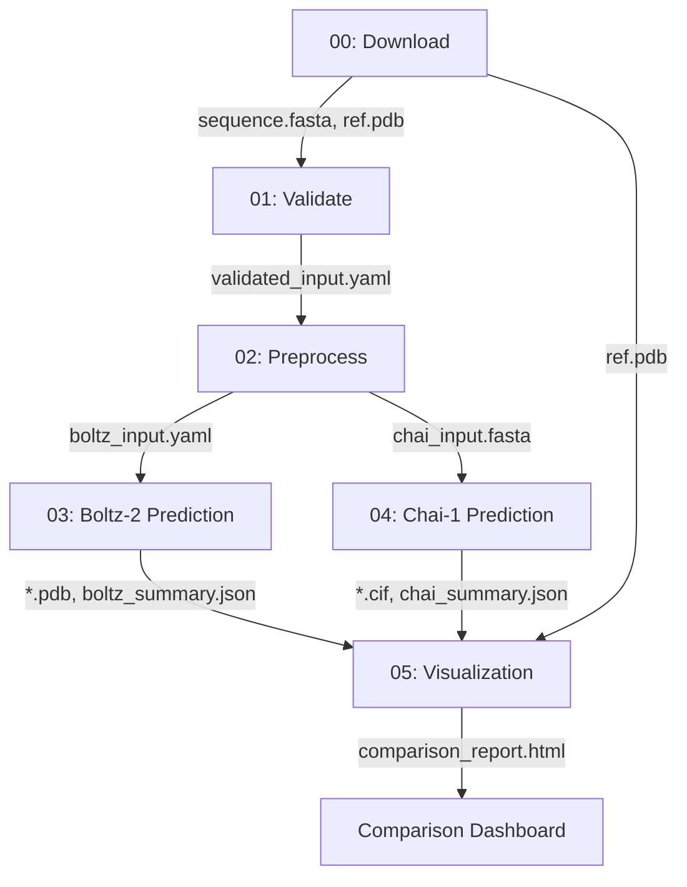

# Workflow 018: Boltz-2 vs Chai-1 Comparison

Side-by-side comparison of Boltz-2 and Chai-1 protein structure predictions from a single input sequence. The workflow runs both tools in parallel on the same input, then generates an interactive HTML report comparing confidence metrics (pLDDT, pTM, iPTM), predicted structures, and optional RMSD against a ground-truth reference.

## Overview

Boltz-2 and Chai-1 are both diffusion-based structure prediction models that support proteins, nucleic acids, and small molecules. This workflow automates the comparison process: it downloads a sequence from UniProt (or accepts user input), converts it to each tool's native format (YAML for Boltz-2, FASTA for Chai-1), runs both predictions in parallel on GPU, and produces a unified comparison dashboard with 3D structure visualization via Mol*. When a reference structure is available (e.g., from UniProt/PDB), RMSD-based alignment is also computed (Wohlwend et al., 2024; Chai Discovery, 2024).

## When to use this workflow

Use this workflow when you want to benchmark or compare structure prediction quality between Boltz-2 and Chai-1 on the same target. It is useful for evaluating which tool performs better on a specific protein or complex, for generating comparison figures for publications, or for validating predictions against experimental structures. Input can be a UniProt accession ID, a Boltz-2 YAML, a Chai-1 FASTA, or a generic FASTA file.

Do not use this workflow if you only need a single prediction from one tool — use workflow-012 (Boltz-2 only) for faster turnaround. Do not use this workflow for molecular docking — use workflow-004 (AutoDock Vina) or workflow-016 (DiffDock-PP).

## Architecture and data flow

Nodes 00 → 01 → 02 run sequentially. Nodes 03 (Boltz-2) and 04 (Chai-1) run **in parallel** after Node 02. Node 05 waits for both predictions to complete.

## Input requirements

- **Format:** One of the following:
  - UniProt accession ID (set via `uniprot_id` parameter in Node 00)
  - Boltz-2 YAML file (with `version` and `sequences` fields)
  - Chai-1 FASTA file (with `>entity_type|name=...` headers)
  - Generic FASTA file (auto-converted)
- **Supported entity types:** protein, RNA, DNA, ligand.
- **Placement:** Place input files in `input_files/`. For UniProt download, no input file is needed.
- **Sample data:** Default downloads human hemoglobin alpha chain (UniProt P69905, 142 residues).

## Workflow nodes

### Node 00: Download Sequence

**Goal:** Download a protein sequence and optional reference structure from UniProt.

**Process:** Fetches the FASTA sequence and, if available, a reference PDB structure from UniProt/PDB using the configured accession ID. The reference structure is used for RMSD comparison in Node 05.

**Scientific notes:** Using a UniProt accession ensures the sequence is from a curated, canonical source. The reference PDB (when available) enables quantitative validation of predictions against experimental structures.

**Outputs:**
- `*.fasta` — downloaded protein sequence
- `*.pdb` — reference structure (if available from PDB)

### Node 01: Validate Inputs

**Goal:** Validate and normalize input to Boltz-2 YAML format.

**Process:** Accepts multiple input formats (Boltz YAML, Chai FASTA, UniProt FASTA, generic FASTA) and converts them all to a standardized `validated_input.yaml` in Boltz-2 format. Validates entity types and sequence content.

**Scientific notes:** Normalizing to a single intermediate format ensures both prediction tools receive equivalent input, making the comparison fair. Entity type mapping is handled automatically (e.g., `rna`/`dna` → `nucleic-acid` for Chai-1).

**Outputs:**
- `validated_input.yaml` — standardized input in Boltz-2 YAML format

### Node 02: Preprocessing

**Goal:** Convert the validated input into native formats for both prediction tools.

**Process:** Reads `validated_input.yaml` and generates two output files: `boltz_input.yaml` (Boltz-2 native YAML) and `chai_input.fasta` (Chai-1 native FASTA with entity type headers). This is the fork point where the pipeline splits into parallel branches.

**Scientific notes:** Boltz-2 uses a structured YAML format with explicit chain IDs and entity types, while Chai-1 uses a FASTA variant with `>entity_type|name=chain_id` headers. Both formats encode the same biological information but in tool-specific conventions.

**Outputs:**
- `boltz_input.yaml` — Boltz-2 native input
- `chai_input.fasta` — Chai-1 native input

### Node 03: Boltz-2 Prediction

**Goal:** Run Boltz-2 structure prediction on the preprocessed input.

**Process:** Invokes `boltz predict` with configurable `diffusion_samples`, `recycling_steps`, and optional MSA server. Collects PDB structure files and confidence metrics (pLDDT, pTM, iPTM, PAE, PDE) into a `boltz_summary.json`.

**Scientific notes:** Boltz-2's confidence score is computed as 0.8 × complex_pLDDT + 0.2 × iPTM. Higher confidence indicates more reliable predictions. PAE and PDE matrices provide spatial error estimates not available from Chai-1's default output.

**Outputs:**
- `*.pdb` — predicted structures
- `confidence_*.json` — per-model confidence metrics
- `boltz_summary.json` — aggregated results with all metrics

### Node 04: Chai-1 Prediction

**Goal:** Run Chai-1 structure prediction on the preprocessed input.

**Process:** Invokes `chai-lab fold` with configurable `num_trunk_recycles` and `num_diffusion_timesteps`. Collects mmCIF structure files and confidence metrics (pLDDT, pTM, iPTM, aggregate_score) into a `chai_summary.json`.

**Scientific notes:** Chai-1's aggregate score is computed as 0.2 × pTM + 0.8 × iPTM − 100 × has_inter_chain_clashes. Unlike Boltz-2, pLDDT is not included in the ranking score, and an explicit clash penalty eliminates structures with inter-chain steric clashes. Chai-1's pLDDT is extracted from the B-factor column of CIF output (scale 0–100, normalized to 0–1 for comparison).

**Outputs:**
- `*.cif` — predicted structures (mmCIF format)
- `chai_summary.json` — aggregated results with all metrics

### Node 05: Visualization

**Goal:** Generate an interactive comparison dashboard for both tools' predictions.

**Process:** Loads summary JSONs from both tools, computes shared metrics (pLDDT, pTM, iPTM) side by side, identifies the best model from each tool, and generates an HTML report with: metric bar charts with winner indicators, tool-specific metrics (Boltz PAE/PDE vs Chai aggregate_score), an interactive Mol* 3D viewer with toggle buttons for reference/Boltz/Chai structures, and RMSD alignment against the reference when available (Cα least-squares superposition via BioPython).

**Scientific notes:** Direct comparison of confidence metrics between tools requires care — the ranking formulas differ (Boltz uses pLDDT-weighted, Chai uses pTM-weighted). The dashboard presents shared metrics (pLDDT, pTM, iPTM) that are comparable, alongside tool-specific scores that are not directly cross-comparable.

**Outputs:**
- `comparison_report.html` — interactive comparison dashboard

## Parameters

### diffusion_samples (Boltz-2, Node 03)

| Value | Description |
|-------|-------------|
| `2` (default) | Fast testing with 2 models. |
| `5`–`10` | Production: more models for better sampling. |

**Test vs production:** Default of 2 is for quick comparison. Use 5+ for reliable benchmarking.

### recycling_steps (Boltz-2, Node 03)

- **Type:** integer
- **Default:** `3`
- **Description:** Refinement iterations through the Boltz-2 model trunk.
- **Guidance:** 3 is sufficient for most single-chain proteins. Increase to 5–7 for multi-domain complexes.

### use_msa_server (Boltz-2, Node 03)

- **Type:** boolean
- **Default:** `true`
- **Description:** Use ColabFold MSA server for evolutionary information.
- **Guidance:** Keep enabled for best accuracy. Disable only for speed testing.

### num_trunk_recycles (Chai-1, Node 04)

- **Type:** integer
- **Default:** `3`
- **Description:** Trunk recycling iterations for Chai-1.
- **Guidance:** Analogous to Boltz-2's `recycling_steps`. Default is suitable for most targets.

### num_diffusion_timesteps (Chai-1, Node 04)

| Value | Description |
|-------|-------------|
| `50` (default) | Fast inference, recommended for testing and most use cases. |
| `200` | Higher quality but requires > 8 GB VRAM. Use for publication-quality results. |

**Trade-off:** More timesteps refine the diffusion process but increase runtime and VRAM requirements significantly.

### uniprot_id (Node 00)

- **Type:** string
- **Default:** `P69905`
- **Description:** UniProt accession ID for sequence download.
- **Guidance:** Change to your target protein's UniProt ID. Default is human hemoglobin alpha chain.

## Outputs and interpretation

### Shared metrics (comparable between tools)

- **pLDDT:** Per-residue local confidence. Scale 0–1. > 0.7 is confident; > 0.9 is very high. Comparable between tools after normalization.
- **pTM:** Overall fold confidence. Scale 0–1. > 0.5 indicates correct fold topology; > 0.8 is high confidence.
- **iPTM:** Interface confidence for multi-chain complexes. Scale 0–1. Higher = more reliable interface prediction.

### Tool-specific metrics (not directly cross-comparable)

- **Boltz-2 confidence score:** 0.8 × pLDDT + 0.2 × iPTM. Emphasizes local structure quality.
- **Chai-1 aggregate score:** 0.2 × pTM + 0.8 × iPTM − clash_penalty. Emphasizes interface quality.
- **Boltz-2 PAE/PDE:** Spatial error estimates in Å. Not available from Chai-1's default output.

### RMSD (when reference available)

Cα RMSD after least-squares superposition against the reference PDB. Lower is better. Values < 2.0 Å indicate excellent agreement with the experimental structure; 2.0–5.0 Å is good.

### comparison_report.html

Interactive dashboard with side-by-side bar charts, winner indicators, Mol* 3D structure viewer with toggle buttons for each tool's best model and the reference structure, and a detailed metrics table for all generated models.

## Quick start

### Running with Docker

| Node | Image |
|------|-------|
| 00, 01, 02, 03, 05 | `ghcr.io/chiral-data/boltz:2025_09_05` |
| 04 | `chai:2026_05_20` |

GPU is required for Nodes 03 and 04 (structure prediction).

### Running on Silva

1. Select workflow-018 from the workflow list
2. Set `uniprot_id` to your target, or upload an input file to `input_files/`
3. Adjust parameters if needed (see Parameters section)
4. Click Run

### Test vs production settings

| Setting | Test (default) | Production |
|---------|---------------|------------|
| `diffusion_samples` (Boltz) | `2` | `5`–`10` |
| `recycling_steps` (Boltz) | `3` | `5` |
| `num_diffusion_timesteps` (Chai) | `50` | `200` |
| `num_trunk_recycles` (Chai) | `3` | `3` |

A successful test run with hemoglobin alpha (P69905, 142 residues) produces predictions from both tools and a comparison dashboard.

## References

- Wohlwend J, Corso G, Passaro S et al. "Boltz-1: Democratizing Biomolecular Interaction Modeling." *bioRxiv*, 2024. DOI: https://doi.org/10.1101/2024.11.19.624167
- Chai Discovery. "Chai-1: Decoding the molecular interactions of life." *bioRxiv*, 2024. DOI: https://doi.org/10.1101/2024.10.10.615955
- [Boltz source code](https://github.com/jwohlwend/boltz)
- [Chai-1 source code](https://github.com/chaidiscovery/chai-lab)
